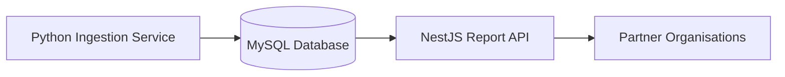
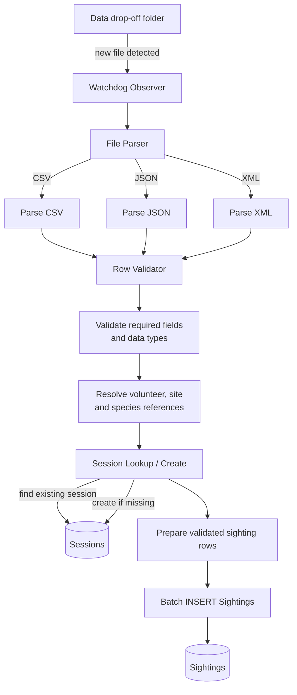
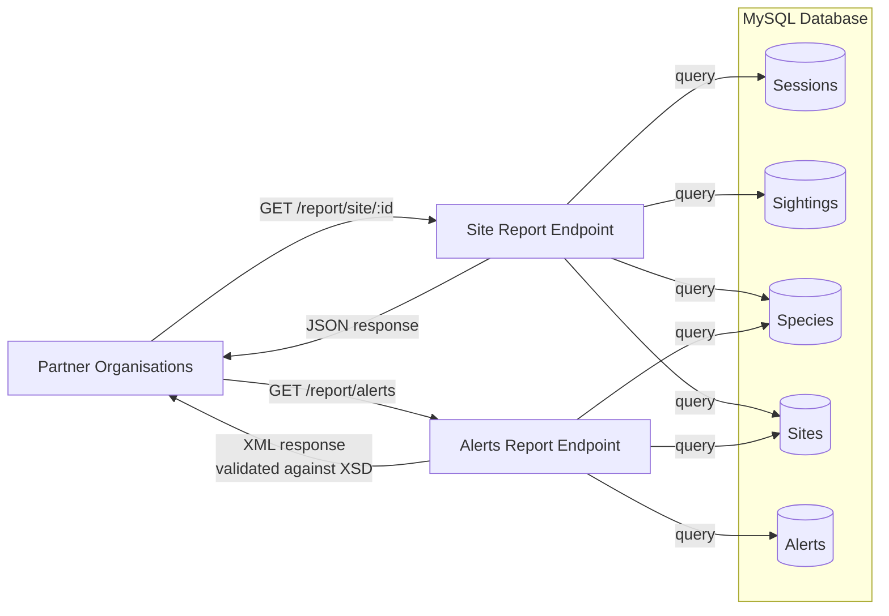
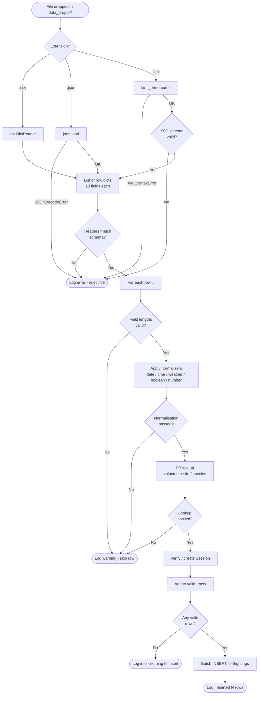
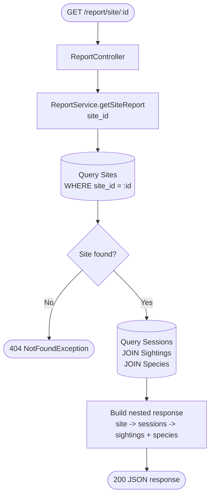
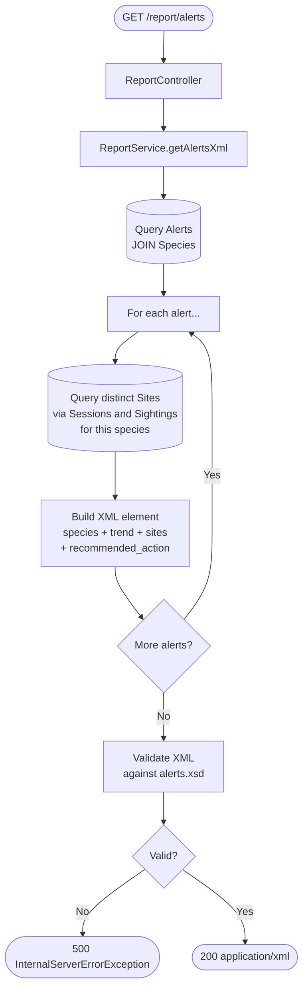

# Architecture and Data Flow

## System Overview

```mermaid
flowchart LR
    A[Python Ingestion Service] --> B[(MySQL Database)]
    B --> C[NestJS Report API]
    C --> D[Partner Organisations]
```

## System Architecture

```mermaid
flowchart TD
    A[Data drop-off folder] -->|new file detected| B[Watchdog Observer]
    B --> C[File Parser]
    C -->|CSV| D1[Parse CSV]
    C -->|JSON| D2[Parse JSON]
    C -->|XML| D3[Parse XML]

    D1 --> E[Row Validator]
    D2 --> E
    D3 --> E

    E --> F[Validate required fields<br/>and data types]
    F --> G[Resolve volunteer, site<br/>and species references]
    G --> H[Session Lookup / Create]

    H -->|find existing session| I[(Sessions)]
    H -->|create if missing| I

    H --> J[Prepare validated sighting rows]
    J --> K[Batch INSERT Sightings]
    K --> L[(Sightings)]
```

```mermaid
flowchart LR
    A[Partner Organisations] -->|GET /report/site/:id| B[Site Report Endpoint]
    A -->|GET /report/alerts| C[Alerts Report Endpoint]

    subgraph DB[MySQL Database]
        D[(Sessions)]
        E[(Sightings)]
        F[(Species)]
        G[(Sites)]
        H[(Alerts)]
    end

    B -->|query| D
    B -->|query| E
    B -->|query| F
    B -->|query| G

    C -->|query| H
    C -->|query| F
    C -->|query| G

    B -->|JSON response| A
    C -->|XML response<br/>validated against XSD| A
```

---

## Data Flow - File Ingestion

```mermaid
flowchart TD
    A([File dropped in data_dropoff/]) --> B{Extension?}

    B -->|.csv| C[csv.DictReader]
    C --> F

    B -->|.json| D[json.load]
    D -->|JSONDecodeError| ERR([Log error - reject file])
    D -->|OK| F

    B -->|.xml| E[lxml_etree.parse]
    E -->|XMLSyntaxError| ERR
    E -->|OK| XSD{XSD schema\nvalid?}
    XSD -->|No| ERR
    XSD -->|Yes| F

    F[List of row dicts\n13 fields each] --> G{Headers match\nschema?}
    G -->|No| ERR
    G -->|Yes| I[For each row...]

    I --> J{Field lengths\nvalid?}
    J -->|No| K([Log warning - skip row])
    J -->|Yes| L[Apply normalisers\ndate / time / weather / boolean / number]

    L --> M{Normalisation\npassed?}
    M -->|No| K
    M -->|Yes| N[DB lookup\nvolunteer / site / species]

    N --> NV{Lookup\npassed?}
    NV -->|No| K
    NV -->|Yes| O[Verify / create Session]

    O --> P[Add to valid_rows]
    P --> Q{Any valid\nrows?}
    Q -->|No| R([Log info - nothing to insert])
    Q -->|Yes| S[Batch INSERT -> Sightings]
    S --> T([Log: Inserted N rows])
```

---

## Data Flow - GET /report/site/:id

```mermaid
flowchart TD
    A([GET /report/site/:id]) --> B[ReportController]
    B --> C[ReportService.getSiteReport\nsite_id]

    C --> D[(Query Sites\nWHERE site_id = :id)]
    D --> E{Site found?}
    E -->|No| F([404 NotFoundException])
    E -->|Yes| G[(Query Sessions\nJOIN Sightings\nJOIN Species)]

    G --> H[Build nested response\nsite -> sessions -> sightings + species]
    H --> I([200 JSON response])
```

---

## Data Flow - GET /report/alerts

```mermaid
flowchart TD
    A([GET /report/alerts]) --> B[ReportController]
    B --> C[ReportService.getAlertsXml]

    C --> D[(Query Alerts\nJOIN Species)]
    D --> E[For each alert...]

    E --> F[(Query distinct Sites\nvia Sessions and Sightings\nfor this species)]
    F --> G[Build XML element\nspecies + trend + sites\n+ recommended_action]

    G --> H{More alerts?}
    H -->|Yes| E
    H -->|No| I[Validate XML\nagainst alerts.xsd]

    I --> J{Valid?}
    J -->|No| K([500 InternalServerErrorException])
    J -->|Yes| L([200 application/xml])
```

