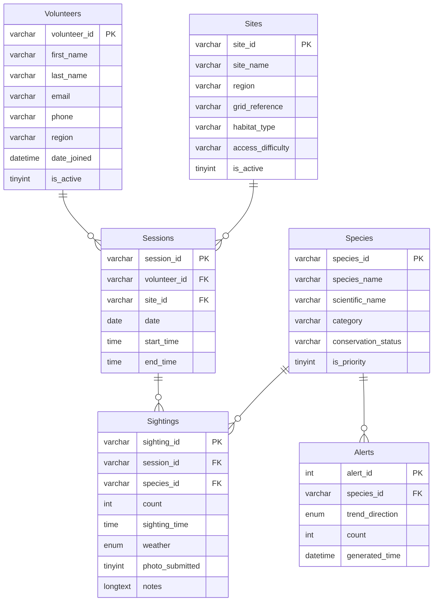

# Database Design

## Normalisation

### UNF

The starting point is a single flat table representing a wildlife sighting record as it might be collected from a volunteer submission, with no structure applied.

| first_name | last_name | Email                 | Phone       | Region     | Site_Name               | Species_Name     | Count | Date       | Time     | Weather | Photo_Submitted | Notes                                     |
|------------|-----------|-----------------------|-------------|------------|-------------------------|------------------|-------|------------|----------|---------|-----------------|-------------------------------------------|
| Eilidh     | MacLeod   | eilidh.m@email.com    | NULL        | Highlands  | Speyside Wetland Centre | Red Squirrel     | 2     | 2025-03-15 | 09:15:00 | Clear   | 1               | Seen near birch woodland edge.            |
| Eilidh     | MacLeod   | eilidh.m@email.com    | NULL        | Highlands  | Speyside Wetland Centre | Pine Marten      | 1     | 2025-03-15 | 18:20:00 | Clear   | 0               | Observed moving between trees at dusk.    |
| Eilidh     | MacLeod   | eilidh.m@email.com    | NULL        | Highlands  | Lochaber Pine Reserve   | Scottish Wildcat | 1     | 2025-12-07 | 06:55:00 | Fog     | 0               | Possible brief sighting near forest edge. |
| Calum      | Ross      | c.ross@email.com      | NULL        | Cairngorms | Skye Coastal Watch      | Golden Eagle     | 1     | 2025-03-16 | 11:40:00 | Cloudy  | 1               | Adult bird soaring above tree line.       |
| Fiona      | Munro     | fiona.munro@email.com | 07700111223 | Moray      | Lochaber Pine Reserve   | Roe Deer         | 3     | 2025-04-03 | 07:35:00 | Fog     | 1               | Small group feeding near woodland edge.   |

**Issues identified:**
- There are no unique identifiers for each row.
- Data redundancy is clearly visible with the volunteers details repeating across multiple rows.

---

### 1NF

**Rule:** Every column must contain atomic (indivisible) values, and each row must be unique.

**Changes made:**
- Added a Sighting ID as a unique identifier

**Result:**

| sighting_id (PK) | first_name  | last_name | email                 | phone       | region     | site_name               | species_name     | count | date       | time     | weather | photo_submitted | notes                                     |
|------------------|-------------|-----------|-----------------------|-------------|------------|-------------------------|------------------|-------|------------|----------|---------|-----------------|-------------------------------------------|
| SI_0001          | Eilidh      | MacLeod   | eilidh.m@email.com    | NULL        | Highlands  | Speyside Wetland Centre | Red Squirrel     | 2     | 2025-03-15 | 09:15:00 | Clear   | 1               | Seen near birch woodland edge.            |
| SI_0002          | Eilidh      | MacLeod   | eilidh.m@email.com    | NULL        | Highlands  | Speyside Wetland Centre | Pine Marten      | 1     | 2025-03-15 | 18:20:00 | Clear   | 0               | Observed moving between trees at dusk.    |
| SI_0003          | Eilidh      | MacLeod   | eilidh.m@email.com    | NULL        | Highlands  | Lochaber Pine Reserve   | Scottish Wildcat | 1     | 2025-12-07 | 06:55:00 | Fog     | 0               | Possible brief sighting near forest edge. |
| SI_0004          | Calum       | Ross      | c.ross@email.com      | NULL        | Cairngorms | Skye Coastal Watch      | Golden Eagle     | 1     | 2025-03-16 | 11:40:00 | Cloudy  | 1               | Adult bird soaring above tree line.       |
| SI_0005          | Fiona       | Munro     | fiona.munro@email.com | 07700111223 | Moray      | Lochaber Pine Reserve   | Roe Deer         | 3     | 2025-04-03 | 07:35:00 | Fog     | 1               | Small group feeding near woodland edge.   |

---

### 2NF

**Rule:** Must be in 1NF, and every non-key attribute must depend on the whole primary key (no partial dependencies).

**Partial dependencies identified:**
- `first_name`, `last_name`, `email`, `phone`, `region` all depend only on the volunteer
- `site_name` depends only on the site
- `species_name` depends only on the species
- `date` depends only on the volunteer and site combination, not on any individual sighting

**Changes made:**
- Split volunteer, site, and species details into their own tables with unique identifiers
- Add a `survey_sessions` table to capture a volunteer's visit to a site, since the date of the outing depend on the session rather than on any individual sighting

**Tables produced:**

Volunteers Table

| volunteer_id (PK) | first_name | last_name | email                 | phone       | region     | date_joined | is_active |
|-------------------|-----------|-----------|-----------------------|-------------|------------|-------------|-----------|
| VT_0001           | Eilidh    | MacLeod   | eilidh.m@email.com    | NULL        | Highlands  | 2024-03-28  | 1         |
| VT_0002           | Calum     | Ross      | c.ross@email.com      | NULL        | Cairngorms | 2024-04-15  | 0         |
| VT_0003           | Fiona     | Munro     | fiona.munro@email.com | 07700111223 | Moray      | 2025-11-29  | 1         |

Sites Table

| site_id (PK) | site_name               | region     | grid_reference | habitat_type | access_difficulty | is_active |
|--------------|-------------------------|------------|----------------|--------------|-------------------|-----------|
| ST_0001      | Speyside Wetland Centre | Highlands  | HL294837       | Freshwater   | Easy              | 1         |
| ST_0002      | Lochaber Pine Reserve   | Highlands  | HL295934       | Woodland     | Moderate          | 1         |
| ST_0003      | Skye Coastal Watch      | Cairngorms | CG924856       | Coastal      | Moderate          | 1         |

Species Table

| species_id (PK) | species_name     | scientific_name     | category | conservation_status   | is_priority |
|-----------------|------------------|---------------------|----------|-----------------------|-------------|
| SP_0001         | Red Squirrel     | Sciurus vulgaris    | Mammal   | Endangered            | 1           |
| SP_0002         | Pine Marten      | Martes martes       | Mammal   | Least Concern         | 0           |
| SP_0003         | Scottish Wildcat | Felis silvestris    | Mammal   | Critically Endangered | 1           |
| SP_0004         | Golden Eagle     | Aquila chrysaetos   | Bird     | Least Concern         | 1           |
| SP_0005         | Roe Deer         | Capreolus capreolus | Mammal   | Least Concern         | 0           |

Survey Sessions Table

| session_id (PK) | volunteer_id (FK) | site_id (FK) | date       | start_time | end_time |
|-----------------|-------------------|--------------|------------|------------|----------|
| SS_0001         | VT_0001           | ST_0001      | 2025-03-15 | 09:00:00   | 19:00:00 |
| SS_0002         | VT_0001           | ST_0002      | 2025-12-07 | 06:30:00   | 08:00:00 |
| SS_0003         | VT_0002           | ST_0003      | 2025-03-16 | 11:00:00   | 13:00:00 |
| SS_0004         | VT_0003           | ST_0002      | 2025-04-03 | 07:00:00   | 09:00:00 |

Sightings Table

| sighting_id (PK) | session_id (FK) | species_id (FK) | count | sighting_time | weather | photo_submitted | notes                                     |
|------------------|-----------------|-----------------|-------|---------------|---------|-----------------|-------------------------------------------|
| SI_0001          | SS_0001         | SP_0001         | 2     | 09:15:00      | Clear   | 1               | Seen near birch woodland edge.            |
| SI_0002          | SS_0001         | SP_0002         | 1     | 18:20:00      | Clear   | 0               | Observed moving between trees at dusk.    |
| SI_0003          | SS_0002         | SP_0003         | 1     | 06:55:00      | Fog     | 0               | Possible brief sighting near forest edge. |
| SI_0004          | SS_0003         | SP_0004         | 1     | 11:40:00      | Cloudy  | 1               | Adult bird soaring above tree line.       |
| SI_0005          | SS_0004         | SP_0005         | 3     | 07:35:00      | Fog     | 1               | Small group feeding near woodland edge.   |

---

### 3NF

**Rule:** Must be in 2NF, and no non-key attribute should depend on another non-key attribute (no transitive dependencies).

**Transitive dependencies identified:**
- None. Each non-key column in every table depends directly on the primary key and nothing else.

**Changes made:**
- No changes required. The schema produced at 2NF already satisfies 3NF.

**Final tables:**

The four tables produced at 2NF are the final normalised schema: Volunteers, Sites, Species, and Sightings.

---

## Entity Relationship Diagram

---

## Indexes

I will add indexes once the database and application are set up. They will be chosen based on the queries that are actually used, with `EXPLAIN` output provided to justify each one for performance improvements on frequently run queries.

---

## Triggers

Two `BEFORE INSERT` triggers have been added to auto-generate the formatted primary key for Sessions and Sightings. This means the application never needs to supply an ID manually.

**before_session_insert** - fires on every insert into `Sessions` and sets `session_id` to `SS_` followed by the next sequential four-digit number (e.g. `SS_0001`).

**before_sighting_insert** - fires on every insert into `Sightings` and sets `sighting_id` to `SI_` followed by the next sequential four-digit number (e.g. `SI_0001`).

Both triggers derive the next number by counting existing rows and adding one, then zero-padding to four digits with `LPAD`.

This may be updated in the future to use MAX() as counting rows is only useful if no rows are ever deleted.

---

## Stored Procedure

I will add the stored procedure at a later date.
